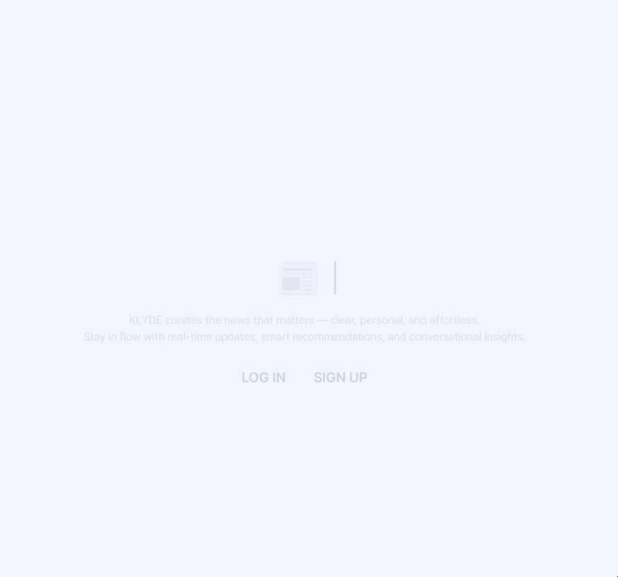
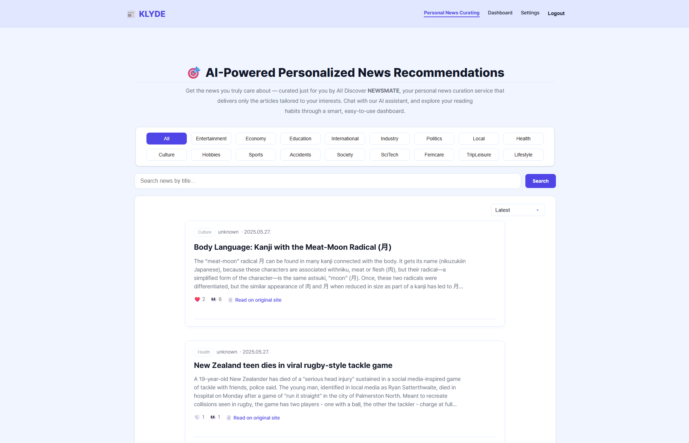
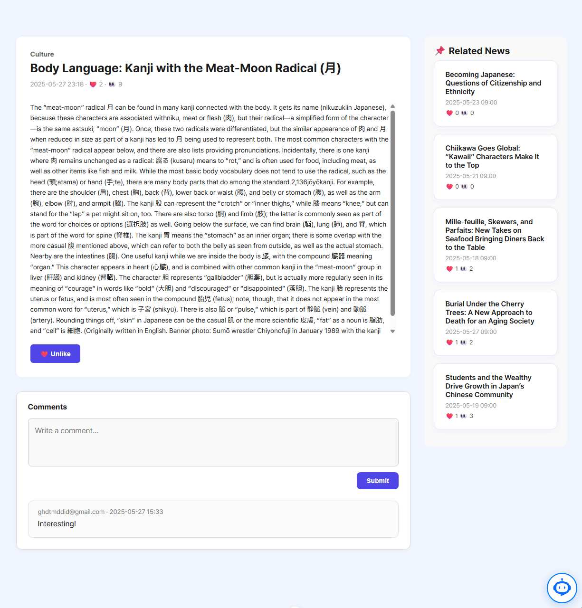

# 🔄 KLYDE Frontend Features

> 프론트엔드 파일 구조는 `DATA-TRACK-PJT-FRONT` 폴더에 위치해 있으며, Vue 3 Composition API 기반으로 구성된 프로젝트입니다.

## 프로젝트 주요 다음의 활성 페이지와 각 요소 설명

---

### 1. 🏠 LandingView.vue

* 첫 로딩 시 등장하는 랜딩 페이지
* **KLYDE 로고**를 강조하여 표시하고, 로그인 / 회원가입 버튼 제공

  

### 2. 👤 LoginView.vue / RegisterView.vue

* JWT 기반 로그인 / 회원가입 페이지
* 로그인/회원가입 성공 시 **NewsView.vue**로 리디렉션

### 3. 📰 NewsView.vue (메인 페이지)

* 로그인 후 최초로 진입하는 메인 페이지
* 사용자 관심 **키워드 필터링 기능**
* **ElasticSearch 기반 검색** 가능
* 뉴스 10개씩 **페이지네이션** 방식으로 표시
* **날짜순 / 추천순 정렬 기능** 제공

  

  

### 4. 📃 NewsDetailView.vue

* 뉴스 카드 클릭 시 **상세 페이지**로 이동
* 주요 용어 강조 표시 및 **관련 뉴스 5개 사이드바** 제공
* 클릭을 통해 **댓글 작성 및 조회 가능**
* 페이지 하단에는 **AI 챗봇 기능(요약/번역)** 제공

  

### 5. 📊 DashBoardView.vue

* 사용자의 **읽은 뉴스 목록**, **관심 키워드 활동** 시각화
* **Chart.js**를 활용한 인터랙티브 차트 구성

### 6. ⚙ SettingsView.vue

* 비밀번호 변경 기능
* 계정 삭제 (개인 정보 삭제 API 연동)
* 이메일 수신 동의 설정

### 7. 🔔 TheHeader.vue & TheFooter.vue

* 공통 UI 컴포넌트로 각 페이지에 라우팅 링크 제공
* Header: `News`, `Dashboard`, `Settings`, `Logout`
* Footer: 간단한 서비스 정보, 추후 기능 추가 예정

### 8. 🛈 ChatBotLauncher.vue / ChatBotPopup.vue

* 뉴스 관련 **요약/번역/질의응답** 제공
* **LangChain + GPT** 기반 AI 챗봇 기능 내장

  

---

## 🧩 주요 컴포넌트

* `PaginationButton.vue`: 뉴스 목록 페이지네이션 버튼
* `NewsCard.vue`, `BoardCard.vue`: 뉴스 카드 및 대시보드 카드 컴포넌트
* `ContentBox.vue`: 뉴스 본문 요약 및 키워드 강조 박스

---

## 🔧 유틸리티 및 API 구성

* `useDate.js`, `useValidation.js`: 날짜 포맷팅, 입력값 검증 유틸 함수
* `api/*.js`: Axios 기반 API 모듈 (news, comment, dashboard, user, chatbot 등)

---
