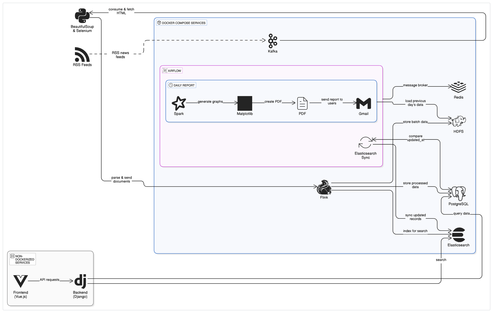
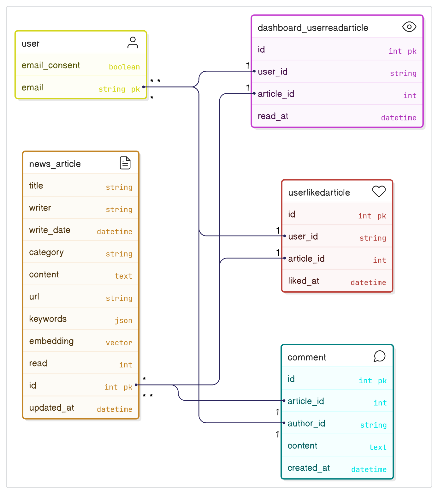

# 📰 **KLYDE - Personalized AI News Curation Platform**

## 1️⃣ **프로젝트 개요**

**KLYDE**는 *Clarity* + *Glide*의 합성어로, 사용자 맞춤 뉴스를 부드럽고 명확하게 추천하는 **AI 기반 뉴스 플랫폼**입니다. 이 플랫폼은 **실시간 뉴스 수집**, **AI 추천 시스템**, **뉴스 요약 및 번역 기능**을 제공하여 사용자 경험을 향상시킵니다.

### 주요 문제 해결 목표

* **뉴스 탐색의 어려움**: 방대한 뉴스 속에서 맞춤형 뉴스 쉽게 찾기.
* **복잡한 정보 처리**: 뉴스 기사 요약 및 번역으로 사용자 이해 지원.
* **맞춤형 뉴스 제공**: 사용자의 관심사에 맞춘 개인화된 뉴스 추천.

## 2️⃣ **주요 기능**

### 1. **맞춤형 뉴스 제공**

* **AI 추천 시스템**으로 사용자의 관심사 분석 후 맞춤형 뉴스 피드를 실시간 제공.
* **카테고리 및 키워드 기반**으로 뉴스 추천.

### 2. **AI 챗봇 (Newsie)**

* **뉴스 요약**, **키워드 추출**, **번역**을 제공하는 AI 챗봇.
* **LangChain**을 이용해 프롬프트 동적 구성 및 정교한 질의 처리.

### 3. **대시보드**

* **뉴스 소비** 데이터를 시각화하여 사용자의 열람 기록, 좋아요, 시청 횟수 분석.
* **개인화된 뉴스 피드**와 **핵심 키워드** 기반 대시보드 제공.

### 4. **댓글 작성 및 관련 뉴스 탐색**

* 기사에 **댓글 작성** 및 다른 사용자의 의견과 상호작용.
* **관련 뉴스 탐색**으로 더 많은 정보를 제공.


## 3️⃣ **기술 스택**

### 1. **Apache Kafka**

* **역할**: 실시간 뉴스 데이터 스트리밍
* **설명**: 뉴스 RSS 피드를 실시간으로 수집하고 처리.

### 2. **Apache Flink**

* **역할**: 실시간 데이터 전처리
* **설명**: 실시간 데이터 처리 후 HDFS, PostgreSQL, Elasticsearch에 저장.

### 3. **Apache Spark**

* **역할**: 배치 데이터 처리 및 분석
* **설명**: 매일 자정 데이터를 분석하여 PDF 리포트 생성 및 발송.

### 4. **PostgreSQL**

* **역할**: 관계형 데이터베이스
* **설명**: 뉴스 기사, 사용자 기록 저장 및 Elasticsearch와 동기화.

### 5. **Elasticsearch**

* **역할**: 검색 및 분석 엔진
* **설명**: 인덱싱된 데이터 검색 및 추천 제공.

### 6. **Django**

* **역할**: 백엔드 웹 프레임워크
* **설명**: 사용자 인증, 기사 조회, 댓글 작성 등의 API 제공.

### 7. **Vue.js**

* **역할**: 프론트엔드 웹 프레임워크
* **설명**: 뉴스 소비 및 대시보드 시각화 웹 페이지 제공.

### 8. **Docker & Docker Compose**

* **역할**: 개발 환경 관리 및 서비스 배포
* **설명**: 각 서비스 컨테이너화하여 독립적 실행 및 서비스 통합.

### 9. **GPT-4o-mini**

* **역할**: AI 기반 챗봇 기능
* **설명**: 뉴스 요약, 키워드 추출, 번역을 GPT-4o-mini 모델로 제공.

## 4️⃣ **시스템 아키텍처**

**KLYDE**의 데이터 흐름 및 구성 요소 간 관계는 아래의 시스템 아키텍처 다이어그램에서 확인할 수 있습니다.



* **뉴스 수집**: **BeautifulSoup** 및 **Selenium**을 사용하여 RSS 및 웹에서 뉴스 수집.
* **데이터 처리**: 실시간 데이터는 **Flink**에서 전처리, 배치 데이터는 **Spark**에서 분석.
* **보고서 생성**: **Spark**로 분석 후 **PDF 리포트** 생성 및 **Gmail**로 발송.
* **데이터 동기화**: **PostgreSQL**과 **Elasticsearch** 간 실시간 동기화.


## 5️⃣ **ERD (Entity Relationship Diagram)**

**KLYDE** 데이터베이스 모델을 시각화한 ERD입니다. 각 엔티티 간 관계를 명확히 보여줍니다.




## 6️⃣ **프로젝트 구조**

```mk
project/
├── backend/                         # 백엔드 서비스 관련 디렉토리
│   ├── chat/                        # 채팅 관련 디렉토리
│   ├── dashboard/                   # 대시보드 관련 디렉토리
│   ├── myproject/                   # 프로젝트 관련 디렉토리
│   ├── news/                        # 뉴스 관련 디렉토리
│   ├── users/                       # 사용자 관련 디렉토리
│   ├── manage.py                    # Django 프로젝트 관리 파일
│   ├── README.md
│   └── requirements.txt             # 백엔드 의존성 관리 파일
│
├── frontend/                        # 프론트엔드 서비스 관련 디렉토리
│   ├── public/                      # 정적 파일 (예: 이미지, 아이콘 등)
│   ├── src/                         # 소스 코드
│   ├── index.html                   # HTML 파일
│   ├── jsconfig.json                # JavaScript 설정 파일
│   ├── package-lock.json            # 패키지 버전 고정 파일
│   ├── package.json                 # 프론트엔드 의존성 관리 파일
│   ├── README.md
│   └── vite.config.js               # Vite 설정 파일
│
├── pipeline/                        # 데이터 파이프라인 관련 디렉토리
│   ├── batch/                       # 배치 처리 관련 디렉토리
│   │   ├── dags/                    # Airflow DAGs 디렉토리
│   │   └── data/                    # 데이터 저장
│   ├── docker/                      # Dockerfile 및 설정 파일
│   ├── hdfs/                        # HDFS 관련 설정 파일
│   ├── requirements/                # 배치 처리 의존성 파일
│   ├── sql/                         # SQL 관련 파일
│   ├── streaming/                   # 실시간 데이터 스트리밍 관련 디렉토리
│   ├── docker-compose.yaml 
│   └── README.md
│
├── public/                          # README.md 용 GIF 및 png 저장
├── .gitignore                       # Git에서 무시할 파일 및 디렉토리 설정
├── .gitattributes                   # Git 속성 설정
└── README.md                        # KLYDE 프로젝트 설명 파일
```


## 7️⃣ **API**

### 1. **사용자 인증 API**

#### **POST /api/auth/login**

* 사용자가 로그인하여 JWT 토큰을 발급받는 API입니다.

#### **POST /api/auth/register**

* 새 사용자를 등록하는 API입니다.


### 2. **기사 관련 API**

#### **GET /api/articles**

* 관심 있는 카테고리의 뉴스를 검색하는 API입니다.

#### **GET /api/articles/{id}**

* 특정 기사에 대한 상세 정보를 조회하는 API입니다.


### 3. **댓글 API**

#### **POST /api/comments**

* 기사에 댓글을 작성하는 API입니다.

#### **GET /api/comments/{article\_id}**

* 특정 기사에 달린 댓글들을 조회하는 API입니다.


### 4. **AI 챗봇 (Newsie) API**

#### **POST /api/chat**

* 뉴스에 대한 요약, 키워드 추출 및 번역을 요청하는 API입니다.


### 5. **대시보드 API**

#### **GET /api/dashboard**

* 사용자의 열람 기록 및 좋아요 기록을 바탕으로 대시보드 데이터를 조회하는 API입니다.


## 8️⃣ **향후 개선 방향**

1. **Elasticsearch 검색 품질 개선**: 문맥 기반 유사도 검색 및 정렬 고도화.
2. **추천 시스템의 개인화 개선**: 클릭 시간, 조회 이력 등 사용자 행동 데이터 반영.
3. **대시보드 시각화 개선**: 직관적 UI 및 반응형 대시보드 개선.
4. **서버 측 페이지네이션**: 현재 방식에서 서버 측 페이지네이션으로 개선.
