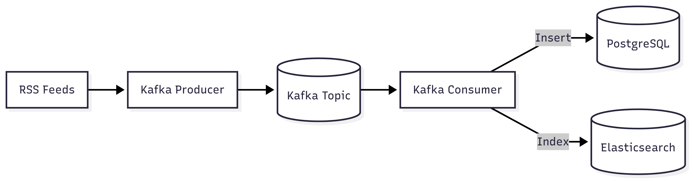

# 📰 KLYDE — Real‑time News & Insights Pipeline

## 1) Overview
이 문서는 **KLYDE** 프로젝트의 데이터 파이프라인에 대한 설명을 제공합니다. **Kafka**, **Spark**, **PostgreSQL**을 사용하여 실시간 데이터 처리 및 배치 처리를 수행하고, PostgreSQL과 Elasticsearch 간 데이터 동기화 작업을 자동화합니다. 시스템은 확장 가능하고 유지보수 가능한 구조로 설계되었습니다.

## 2) Data Flow


- Producer: RSS 파싱→본문 스크랩→URL 해시를 Kafka key로 발행
- Consumer: 전처리 후 Postgres 저장, 성공 시 Elasticsearch 색인(upsert)

### DAG
- **daily_report_dag** (매일 01:00 KST): Spark로 전일 데이터 집계→PDF 생성→수신 동의 사용자에게 메일 발송
- **sync_postgres_to_elasticsearch_dag** (10분 주기): Postgres 변경분만 조회→Elasticsearch upsert로 보정

## 3) Visualizations

1. **KPI 카드** (총 기사/고유 카테고리/DoD/Top 키워드)
   * 하루 상황을 10초 내 파악

2. **14일 트렌드 라인** (일별 기사 수)
   * 계절성·이벤트 영향 감지, 이상치 확인

3. **시간대 분포 바차트** (0–23시)
   * 수집/트래픽 피크 시간대 파악

4. **키워드 TOP10**
   * 당일 이슈 키워드 파악

5. **카테고리 TOP10**
   * 당일 이슈 카테고리 파악

6. **워드클라우드**
   * 한눈에 맥락 확인(요약형 시각라인), 리포트 가독성 강화

> 기준: 전일 00:00–24:00 KST. 
> PDF 경로: `pipeline/news-batch/data/news_summary/daily_report_YYYYMMDD.pdf`

## 4) Repo

```
pipeline/
├─ news-pipeline/   # producer/consumer
├─ news-batch/      # airflow dags + spark (report, sync)
├─ docker/          # Dockerfiles
├─ sql/             # Schema init + test
└─ docker-compose.yaml
```

## 5) Notes

* Producer는 **URL 해시를 Kafka key**로 사용(중복 억제/파티셔닝)
* Consumer는 **DB 실패 시 ES 인덱싱 스킵**(일관성 우선) → 재처리 용이

